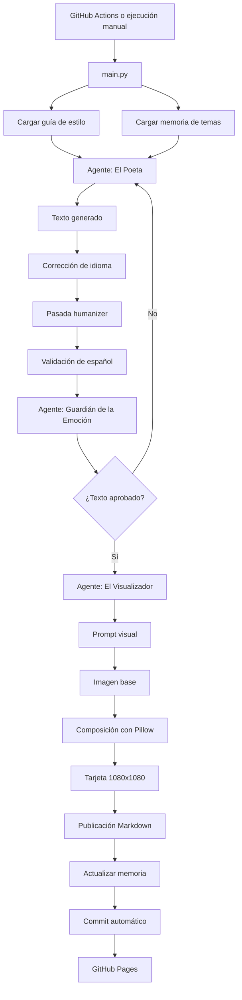

# Procedural Writing System

Sistema de escritura procedural con agentes de inteligencia artificial, validación editorial, memoria externa, generación visual y publicación web automática.


## Demo

- **Web:** https://faridSprado.github.io/procedural-writing-system/
- **Repositorio:** https://github.com/faridSprado/procedural-writing-system.git

## Sobre el proyecto

**Procedural Writing System** es un proyecto experimental de inteligencia artificial que automatiza un flujo editorial completo: genera textos breves, los revisa, aplica una pasada humanizer, crea una dirección visual, compone una tarjeta gráfica con el texto completo y publica el resultado en una web estática.

El sistema usa como caso de aplicación una publicación digital llamada **Ecos del Alma**, una colección de escritos breves sobre memoria, vínculos, límites, cansancio, despedidas y regreso a uno mismo.

La intención no es generar texto con un único prompt, sino construir una arquitectura controlada donde cada salida pase por reglas, memoria, validación y publicación automatizada.

## Objetivo

El objetivo principal es demostrar cómo un modelo de lenguaje puede formar parte de un sistema creativo más amplio.

El proyecto aborda varios problemas comunes en la generación automática de contenido:

- falta de consistencia entre publicaciones;
- textos demasiado genéricos o con clichés;
- errores de idioma o mezclas inesperadas;
- repetición de temas;
- repetición de objetos o escenas de apertura;
- dependencia de procesos manuales para publicar;
- ausencia de una identidad visual consistente.

Para resolverlo, el sistema combina agentes especializados, una guía de estilo en JSON, memoria externa, validación editorial, reglas humanizer, generación visual y automatización con GitHub Actions.

## Qué hace

Cada ejecución sigue este flujo:

1. Carga una guía de estilo desde `biblia/guia_estilo.json`.
2. Revisa los temas usados recientemente.
3. Selecciona un nuevo tema.
4. Genera un texto breve en español.
5. Aplica una corrección de idioma.
6. Detecta palabras o fragmentos sospechosos fuera del español.
7. Aplica una pasada humanizer para quitar tono de plantilla.
8. Revisa el texto con un agente editorial.
9. Si el texto no cumple los criterios, vuelve a intentarlo.
10. Genera una dirección visual para acompañar el escrito.
11. Crea una imagen base.
12. Compone una tarjeta editorial de 1080x1080 px con el texto completo.
13. Crea una publicación Markdown en `docs/_posts/`.
14. Actualiza la memoria del sistema.
15. Publica la nueva entrada mediante GitHub Pages.
16. En la portada, muestra los escritos en bloques de diez para que la lectura no se vuelva pesada.

## Caso de uso: Ecos del Alma

**Ecos del Alma** es la publicación generada por el sistema.

Cada entrada contiene:

- un tema;
- un escrito breve;
- una tarjeta visual con el texto completo;
- una página individual;
- fecha de publicación;
- metadatos para reconstruir o actualizar la pieza.

La portada conserva todos los escritos en el mismo lugar, pero los agrupa de diez en diez con controles de página al final de la lista.

Este caso de uso permite probar el sistema en un escenario real: una línea editorial definida, estética consistente, generación periódica y publicación automática.

## Arquitectura



## Módulos principales

### `main.py`

Orquesta el flujo completo.

Responsabilidades:

- cargar memorias;
- ejecutar los agentes;
- controlar reintentos;
- generar la publicación Markdown;
- guardar la tarjeta visual;
- actualizar los archivos de memoria;
- dejar todo listo para commit automático.

### `agentes/agentes.py`

Contiene los agentes de inteligencia artificial y las capas de validación.

Incluye:

- generación del texto;
- corrección de idioma;
- detección de palabras sospechosas;
- pasada humanizer;
- bloqueo de motivos sobreusados;
- revisión editorial;
- generación de prompt visual.

### `utils/render_social.py`

Compone la tarjeta visual final.

Toma:

- el texto;
- el tema;
- la imagen base;
- el ID de publicación.

Y genera una tarjeta cuadrada en:

```text
docs/assets/social/
```

### `utils/rebuild_cards.py`

Reconstruye tarjetas existentes cuando cambia el diseño visual o se corrige un texto publicado.

También actualiza el campo `image` dentro del front matter de cada publicación.

### `biblia/guia_estilo.json`

Funciona como guía de estilo y configuración creativa.

Define:

- tono general;
- temas disponibles;
- recursos literarios permitidos;
- estilos a evitar;
- estructura sugerida;
- restricciones de lenguaje.

### `memoria/estado_publicacion.json`

Registra publicaciones generadas:

- ID;
- fecha;
- tema;
- archivo;
- imagen;
- background usado;
- puntuación editorial.

### `memoria/temas_usados.json`

Evita repetir temas cercanos entre publicaciones.

## Agentes del sistema

### 1. El Poeta

Genera el texto principal a partir del tema seleccionado y de la guía de estilo.

Recibe instrucciones sobre:

- tono;
- longitud;
- recursos literarios;
- restricciones;
- idioma;
- estructura esperada.

Su salida debe ser únicamente el texto final, sin título, firma ni explicación.

### 2. Corrector de idioma y humanizer

Después de generar el texto, el sistema aplica una pasada de seguridad para mantener la salida completamente en español. Luego revisa la redacción con reglas humanizer: menos frases hechas, menos símbolos inflados, más detalle concreto y más variedad entre publicaciones.

Esta capa intenta corregir:

- palabras sueltas en inglés;
- spanglish;
- tokens extraños;
- mezclas tipo `calleOutside`;
- respuestas con formato no deseado.
- motivos bloqueados por repetición editorial.

### 3. El Guardián de la Emoción

Revisa si el texto puede publicarse.

Evalúa:

- naturalidad;
- calidad emocional;
- ausencia de clichés;
- uso de imágenes concretas;
- coherencia con el tema;
- cumplimiento de la guía de estilo;
- uso completo del español.

Si el texto no pasa la revisión, se rechaza y el flujo vuelve a generar.

### 4. El Visualizador

Genera un prompt visual para crear una imagen base relacionada con el texto.

Esa imagen no se publica directamente: se usa como fondo para crear una tarjeta editorial con diseño consistente. El texto final se renderiza localmente para evitar recortes y errores tipográficos de la IA de imagen.

## Control de calidad

El proyecto incluye varias capas para reducir errores:

- prompt de generación con restricciones claras;
- corrección automática de idioma;
- detección local de tokens sospechosos;
- agente revisor con salida JSON;
- puntuación mínima para aprobar;
- reintentos automáticos;
- memoria de temas recientes;
- front matter estructurado;
- reconstrucción de tarjetas cuando cambia el diseño.

## Estructura del proyecto

```text
procedural-writing-system/
├── .github/
│   └── workflows/
│       └── daily-escrito.yml
├── agentes/
│   └── agentes.py
├── biblia/
│   └── guia_estilo.json
├── docs/
│   ├── _config.yml
│   ├── index.md
│   ├── proceso.md
│   ├── _layouts/
│   │   ├── default.html
│   │   └── post.html
│   ├── _posts/
│   └── assets/
│       ├── css/
│       │   └── style.css
│       └── social/
├── memoria/
│   ├── estado_publicacion.json
│   └── temas_usados.json
├── utils/
│   ├── render_social.py
│   └── rebuild_cards.py
├── config.py
├── main.py
├── requirements.txt
├── .env.example
├── .gitignore
└── README.md
```

## Tecnologías

- **Python 3.11+**: orquestación del flujo.
- **Groq API**: generación y revisión de texto.
- **Llama 3.3 70B Versatile**: modelo principal de lenguaje.
- **Pollinations.ai**: generación de imagen base mediante URL.
- **Pillow**: composición de tarjetas visuales.
- **Markdown**: formato de publicación.
- **Jekyll**: renderizado de la web estática.
- **GitHub Pages**: hosting del sitio.
- **GitHub Actions**: automatización programada.
- **JSON**: configuración creativa y memoria externa.

## Instalación local

### 1. Clonar el repositorio

```bash
git clone https://github.com/faridSprado/procedural-writing-system.git
cd procedural-writing-system
```

### 2. Crear entorno virtual

En Windows PowerShell:

```bash
python -m venv venv
.\\venv\\Scripts\\Activate.ps1
```

Si PowerShell bloquea la activación:

```bash
Set-ExecutionPolicy -ExecutionPolicy RemoteSigned -Scope CurrentUser
.\\venv\\Scripts\\Activate.ps1
```

### 3. Instalar dependencias

```bash
python -m pip install -r requirements.txt
```

### 4. Configurar variables de entorno

Copia el archivo de ejemplo:

```bash
copy .env.example .env
```

Dentro de `.env`, agrega tu configuración:

```env
GROQ_API_KEY=gsk_tu_clave_de_groq
GROQ_MODEL=llama-3.3-70b-versatile
PROJECT_TIMEZONE=America/Bogota
MAX_INTENTOS=5
TEMAS_RECIENTES_A_EVITAR=6
```

El archivo `.env` no debe subirse al repositorio.

### 5. Ejecutar localmente

```bash
python main.py
```

Si todo funciona, se creará:

```text
docs/_posts/
docs/assets/social/
```

con una nueva publicación y su tarjeta visual.

## Reconstruir tarjetas existentes

Si se cambia el diseño visual, se corrige un texto o se quiere actualizar la imagen de publicaciones anteriores:

```bash
python utils/rebuild_cards.py
```

Este comando vuelve a generar las tarjetas en:

```text
docs/assets/social/
```

y actualiza el campo `image` de cada publicación Markdown.

## Automatización con GitHub Actions

El workflow está en:

```text
.github/workflows/daily-escrito.yml
```

El flujo automático:

1. Descarga el repositorio.
2. Instala Python.
3. Instala dependencias.
4. Ejecuta `python main.py`.
5. Guarda la publicación generada.
6. Hace commit y push de los archivos nuevos.

La ejecución automática está configurada con cron.

Ejemplo para generar una publicación todos los días a las 3:00 a. m. Colombia:

```yaml
schedule:
  - cron: "0 8 * * *"
```

GitHub Actions usa UTC, por eso `08:00 UTC` corresponde a `3:00 a. m.` en Colombia.

También se puede ejecutar manualmente desde la pestaña **Actions** usando `workflow_dispatch`.

## Configurar secretos en GitHub

Para que el workflow funcione, el repositorio necesita un secret llamado:

```text
GROQ_API_KEY
```

Ruta:

```text
Settings → Secrets and variables → Actions → New repository secret
```

## GitHub Pages

La web se publica desde la carpeta:

```text
docs/
```

Configuración recomendada:

```text
Settings → Pages
Source: Deploy from a branch
Branch: main
Folder: /docs
```

## Publicaciones generadas

Cada publicación queda como archivo Markdown dentro de:

```text
docs/_posts/
```

Y contiene front matter similar a:

```yaml
---
layout: post
title: "Después del ruido"
date: 2026-05-19 03:00:00 -0500
categories: [ecos-del-alma]
tema: "Después del ruido"
image: "/assets/social/escrito-0014.png"
background_image: "https://image.pollinations.ai/prompt/..."
---
```

La imagen final queda en:

```text
docs/assets/social/
```

## Decisiones técnicas

### Guía de estilo en JSON

La guía de estilo está separada del código para poder modificar el comportamiento creativo sin tocar la lógica del sistema.

### Memoria externa

El sistema guarda estado entre ejecuciones para evitar repetir temas y mantener trazabilidad de publicaciones.

### Agentes separados

Cada agente tiene una responsabilidad clara. Esto hace que el flujo sea más fácil de probar, modificar y depurar.

### Validación posterior a la generación

El texto no se publica inmediatamente después de ser generado. Primero pasa por corrección, detección de idioma y revisión editorial.

### Publicación como Markdown

Markdown permite que el contenido sea simple, versionable y compatible con Jekyll/GitHub Pages.

### Generación visual local

La imagen base se usa como fondo, pero el diseño final se compone localmente con Pillow para mantener consistencia visual.

## Posibles mejoras

- Publicación automática en Instagram o Threads.
- Exportación vertical para stories.
- Dashboard con métricas de temas, fechas y puntuaciones editoriales.
- Selector de líneas editoriales.
- Soporte para múltiples guías de estilo.
- Feed RSS.
- Modo oscuro.
- Tests automatizados para validación de front matter.
- Interfaz web para ejecutar el sistema bajo demanda.
- Registro de costos y tiempos de generación.

## Autor

**Farid Prado**

Proyecto personal de inteligencia artificial aplicada a escritura procedural, automatización editorial y publicación web.
